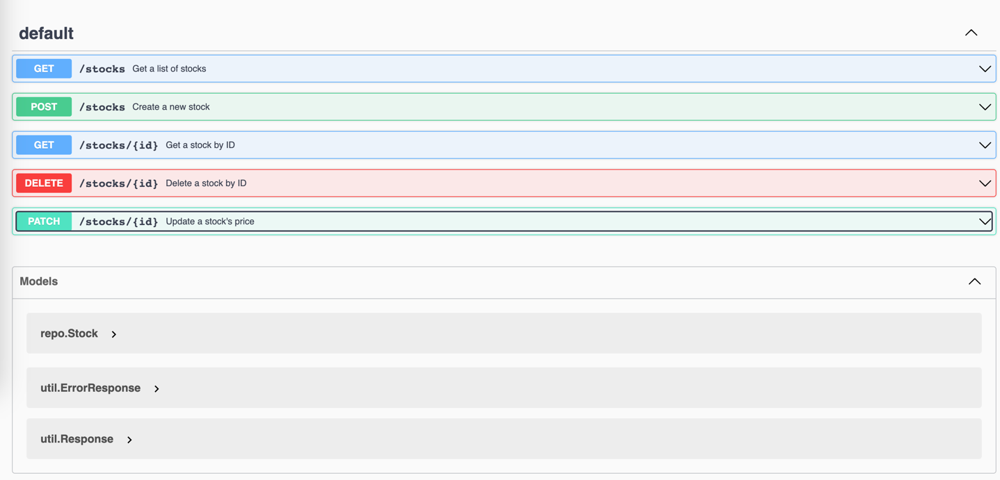
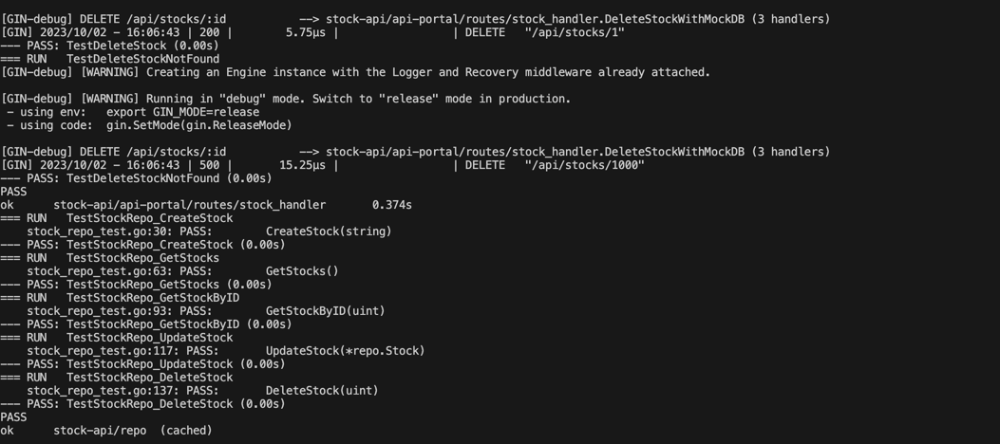

# nodo-demo

demo backend in go for nodo.xyz

## How to run :

- Make sure to fill in `.env` file with the correct values
- Installed Go
- Installed Make
- Installed Docker & Docker Compose

## To download dependencies :

`make get`

## To run :

`make run`

## To regenerate swagger docs :

`make docs`

### swagger docs sit at url :

[http://localhost:8080/docs/index.html](http://localhost:8080/docs/index.html)

Image :

## To run docker :

First start the database in docker by calling :
`make docker`

## Then run the migration file by calling :

`make migrate`

### The database will be seeded with the data in `stock.sql` file

`make docker`

## To run tests :

`make test`

Result :

